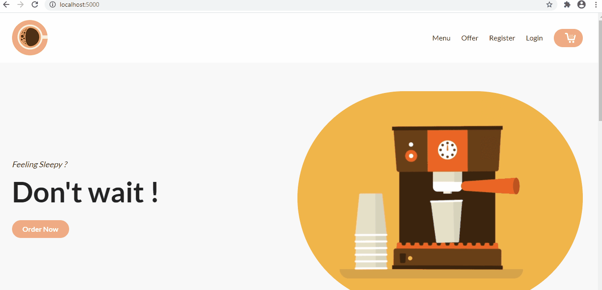
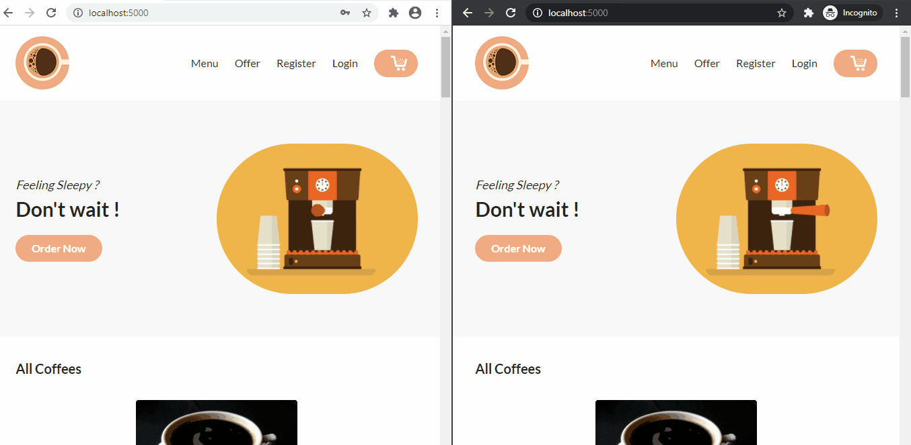

<p align="center">  </p>

# Coffee Cafe

Building an application to order coffee and view its realtime order update using socket.io

Demo Link: [Coffee Cafe](https://cafecoffee.herokuapp.com/)

```
Register as a new user or
User Login:
email: johndoe@example.com
password: user_password

Admin Login:
email: admin@coffeecafe.com
password: admin_password
```


### :arrow_right: Technologies Used

:one: MongoDB

:two: Express

:three: Node

:four: Socket.io

### :arrow_right: Get Started

Clone the repository

`https://github.com/sureshmangs/Realtime-Coffee-Tracker.git`

In the project directory(Realtime-Coffee-Tracker)

`npm install`

In the root directory, create a .env file, inside the .env file, set the following fields

```
SECRET = 'xxxxxxxxxxxx express session secret xxxxxxxxxxxx'
MONGODB_URI = 'xxxxxxxxxxxx MongoDB Atlas Key xxxxxxxxxxxx'
```

To run the application in development mode, in the root dirctory

`npm run start-dev`

### :arrow_right: Deploy to Heroku

Create a Procfile, inside the Procfile

```
web: npm run start
```
In the package.json file, add the following scripts

```
"scripts": {
    "start": "node server.js",
    "heroku-postbuild": "npm install"  
}
  ```

Run the following commands
```
git init
git add .
git commit -m "Deploy to Heroku"
heroku create <name of the app>
git push heroku master
```

### :arrow_right: Demo

##### Homepage



##### Full Demo 
(`window1: user`   `window2: admin`)


